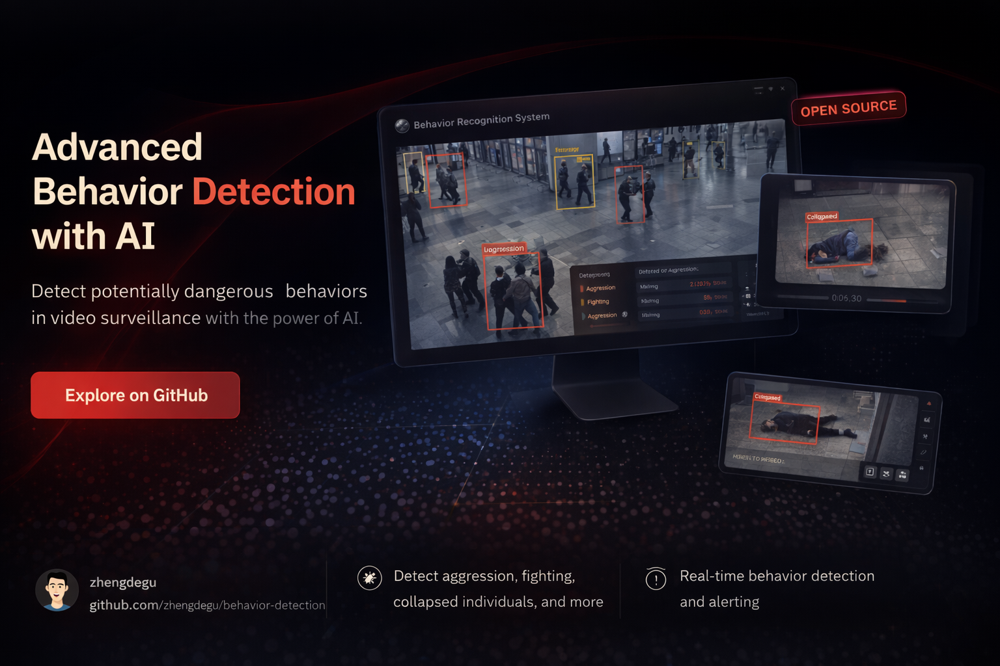

# Behavior Detection System

Real-time video behavior detection system supporting **crowd detection**, **fight detection**, and **fall detection**. Frontend and backend are packaged into a single Docker image with MQTT event push to third-party systems.



## Features

| Feature | Description |
|---------|-------------|
| Crowd Detection | Connected component clustering, alerts when people count exceeds threshold in an area |
| Fight Detection | Multiple people in close proximity + high-speed motion + Pose enhancement (wrist punching features) |
| Fall Detection | Bbox aspect ratio sudden change + Pose enhancement (head below hips) |
| Video Analysis | Upload video files for offline analysis, generates annotated video and event reports |
| MQTT Push | Event lifecycle (triggered 鈫?updating 鈫?resolved) push to external systems |
| Live Preview | Low-latency camera preview via go2rtc WebRTC/MSE |

## Tech Stack

**Backend:** Python 3.12 路 FastAPI 路 YOLO (Ultralytics) 路 ByteTrack 路 YOLO Pose 路 OpenCV 路 SQLite 路 paho-mqtt

**Frontend:** React 19 路 TypeScript 路 Vite 路 Tailwind CSS v4

**Infrastructure:** Docker multi-stage build 路 go2rtc (RTSP proxy) 路 NVIDIA GPU support

## Quick Start

### Docker Deployment (Recommended)

```bash
# Clone the repository
git clone https://github.com/zhengdegu/behavior-detection.git
cd behavior-detection
```

**Without GPU (CPU mode):**

```bash
docker compose up -d --build
```

**With NVIDIA GPU:**

```bash
docker compose -f docker-compose.yml -f docker-compose.gpu.yml up -d --build
```

Visit `http://localhost:18000`

### Pull Pre-built Images

```bash
# CPU version (recommended, smaller size)
docker pull ghcr.io/zhengdegu/behavior-detection:latest

# GPU version (CUDA 12.8, requires nvidia-container-toolkit)
docker pull ghcr.io/zhengdegu/behavior-detection:gpu
```

Run pre-built images with docker-compose:

**Without GPU:**

```yaml
# docker-compose.yml
services:
  behavior-detection:
    image: ghcr.io/zhengdegu/behavior-detection:latest
    ports:
      - "18000:18000"
      - "11984:1984"
      - "18555:8555/tcp"
      - "18555:8555/udp"
    environment:
      - GO2RTC_WEBRTC_CANDIDATES=${SERVER_PUBLIC_IP:-}
    volumes:
      - ./data:/app/data
      - ./configs:/app/configs
    restart: unless-stopped
```

**With NVIDIA GPU:**

```yaml
# docker-compose.yml
services:
  behavior-detection:
    image: ghcr.io/zhengdegu/behavior-detection:gpu
    ports:
      - "18000:18000"
      - "11984:1984"
      - "18555:8555/tcp"
      - "18555:8555/udp"
    environment:
      - GO2RTC_WEBRTC_CANDIDATES=${SERVER_PUBLIC_IP:-}
    volumes:
      - ./data:/app/data
      - ./configs:/app/configs
    deploy:
      resources:
        reservations:
          devices:
            - driver: nvidia
              count: all
              capabilities: [gpu]
    restart: unless-stopped
```

```bash
docker compose up -d
```

> **Note:** Inference is slower in CPU mode. Consider lowering the detection FPS (e.g., 1-2) to reduce CPU load. GPU mode requires [nvidia-container-toolkit](https://docs.nvidia.com/datacenter/cloud-native/container-toolkit/install-guide.html).

### Docker Run

If not using docker-compose, you can start directly with `docker run`:

**Without GPU:**

```bash
docker run -d \
  --name behavior-detection \
  -p 18000:18000 \
  -p 11984:1984 \
  -p 18555:8555/tcp \
  -p 18555:8555/udp \
  -e GO2RTC_WEBRTC_CANDIDATES=YOUR_PUBLIC_IP:18555 \
  -v $(pwd)/data:/app/data \
  -v $(pwd)/configs:/app/configs \
  --restart unless-stopped \
  ghcr.io/zhengdegu/behavior-detection:latest
```

**With NVIDIA GPU:**

```bash
docker run -d \
  --gpus all \
  --name behavior-detection \
  -p 18000:18000 \
  -p 11984:1984 \
  -p 18555:8555/tcp \
  -p 18555:8555/udp \
  -e GO2RTC_WEBRTC_CANDIDATES=YOUR_PUBLIC_IP:18555 \
  -v $(pwd)/data:/app/data \
  -v $(pwd)/configs:/app/configs \
  --restart unless-stopped \
  ghcr.io/zhengdegu/behavior-detection:gpu
```

> On Windows PowerShell, replace `$(pwd)` with `${PWD}`.

### Local Development

```bash
# Backend
cd backend
pip install -r requirements.txt
python -m src.main
# API runs at http://localhost:18000

# Frontend (in another terminal)
cd frontend
npm install
npm run dev
# Dev server runs at http://localhost:5173, auto-proxies API to port 18000
```

## Usage Guide

### 1. Add Cameras

Open `http://localhost:18000` and go to the **Config** page:

1. Click the **+ Add** button
2. Fill in Camera ID, name, and RTSP URL
3. Click **Create**

The camera will automatically start streaming and detecting after being added.

### 2. Configure Detection Rules

On the Config page, select a camera:

- **ROI Area**: Click on the left canvas to draw a detection region (polygon). Only people within the region will trigger alerts.
- **Detection Rules**: Configure parameters and toggles for three detection rules on the right side:
  - **Crowd**: `max_count` (person count threshold), `radius` (gathering radius in px), `cooldown` (cooldown time in seconds)
  - **Fight**: `proximity_radius` (close-range threshold in px), `min_speed` (minimum motion speed in px/s)
  - **Fall**: `ratio_threshold` (aspect ratio threshold), `min_y_drop` (minimum drop distance in px)

Click **Save Configuration** to save. The camera will automatically restart with the new configuration.

### 3. Live Monitoring

Go to the **Live** page:

- Left: Camera grid with low-latency preview via go2rtc WebRTC, detection boxes overlaid in real-time
- Right: Event Feed showing real-time alert events (crowd/fight/fall)

### 4. Event Viewing

Go to the **Events** page:

- Filter by event type (All / Crowd / Fight / Fall)
- View event screenshots, timestamps, cameras, and details
- Click screenshots to enlarge

### 5. Video Analysis

Go to the **Analyze** page:

1. Upload a video file
2. Configure ROI and detection rules (optional)
3. Click Start Analysis
4. After completion, view the event list and download the annotated video

### 6. MQTT Event Push

#### Global Configuration

Go to the MQTT Configuration section at the bottom of the **System** page:

1. Enter the Broker address and port
2. Enter the topic specified by the third-party system
3. Enter username/password (if required)
4. Set the updating message interval (default 30 seconds)
5. Check **Enable MQTT Publishing**
6. Click **Save MQTT Config**

#### Camera-Level Configuration

On the **Config** page, select a camera. In the MQTT Publishing section below Detection Rules:

1. Check **Enable MQTT for this camera**
2. Select event types to push (Crowd / Fight / Fall)
3. Save the configuration

#### MQTT Message Format

Events follow a lifecycle model. The same event sends `triggered` once, `updating` at intervals during persistence, and `resolved` when it disappears:

```json
{
  "event_id": "evt_cam01_crowd_20260429_143052",
  "status": "triggered",
  "type": "crowd",
  "camera_id": "cam01",
  "camera_name": "Lobby Entrance",
  "timestamp": "2026-04-29T14:30:52+08:00",
  "detail": "Crowd alert: 6 people gathered within 200px radius",
  "data": {
    "count": 6,
    "track_ids": [1, 3, 5, 7, 9, 12],
    "bbox": [120, 80, 580, 420],
    "confidence": 0.85
  },
  "image_url": "events/cam01_crowd_t1_20260429_143052_123.jpg",
  "duration": 0.0
}
```

| Status | Description | When Sent |
|--------|-------------|-----------|
| `triggered` | Anomaly first detected | Sent immediately |
| `updating` | Anomaly persists | Sent every N seconds (configurable) |
| `resolved` | Anomaly disappeared | Sent when anomaly is no longer detected |

## YOLO Models

The system requires YOLO model files placed in the `data/models/` directory:

- `yolo26m.pt` 鈥?Object detection model (required)
- `yolo26m-pose.pt` 鈥?Pose estimation model (optional, enhances fight/fall detection accuracy)

Model files must be manually downloaded to `data/models/` before first startup.

## API Reference

| Method | Path | Description |
|--------|------|-------------|
| GET | `/api/cameras` | List cameras |
| POST | `/api/cameras` | Add camera |
| PUT | `/api/cameras/{id}` | Update camera configuration |
| DELETE | `/api/cameras/{id}` | Delete camera |
| GET | `/api/cameras/{id}/snapshot` | Get camera snapshot |
| GET | `/api/events` | List events (supports sub_type, camera_id, limit filters) |
| GET | `/api/status` | System status |
| POST | `/api/video-analysis/upload` | Upload video |
| GET | `/api/video-analysis/tasks` | List analysis tasks |
| POST | `/api/video-analysis/tasks/{id}/start` | Start analysis |
| GET | `/api/mqtt/config` | Get MQTT configuration |
| PUT | `/api/mqtt/config` | Update MQTT configuration |
| GET | `/api/mqtt/status` | MQTT connection status |
| WS | `/ws/events` | Real-time event push |
| WS | `/ws/detections/{camera_id}` | Real-time detection box push |

## Project Structure

```
behavior-detection/
鈹溾攢鈹€ backend/
鈹?  鈹溾攢鈹€ src/
鈹?  鈹?  鈹溾攢鈹€ main.py              # Main entry point
鈹?  鈹?  鈹溾攢鈹€ server.py            # FastAPI web server + REST API
鈹?  鈹?  鈹溾攢鈹€ config.py            # Pydantic configuration models
鈹?  鈹?  鈹溾攢鈹€ database.py          # SQLite database + Repository
鈹?  鈹?  鈹溾攢鈹€ analyzer.py          # Video analysis pipeline (one thread per camera)
鈹?  鈹?  鈹溾攢鈹€ detector.py          # YOLO detector + Pose detector
鈹?  鈹?  鈹溾攢鈹€ detection.py         # Detection data class
鈹?  鈹?  鈹溾攢鈹€ geometry.py          # Geometry utilities (point-in-polygon)
鈹?  鈹?  鈹溾攢鈹€ go2rtc.py            # go2rtc stream management (RTSP proxy)
鈹?  鈹?  鈹溾攢鈹€ mqtt_publisher.py    # MQTT publisher (paho-mqtt v2)
鈹?  鈹?  鈹溾攢鈹€ event_session.py     # Event session manager (lifecycle + merge)
鈹?  鈹?  鈹斺攢鈹€ rules/               # Behavior rule engine
鈹?  鈹?      鈹溾攢鈹€ engine.py        # Rule aggregation
鈹?  鈹?      鈹溾攢鈹€ base.py          # Rule base class (confirm + cooldown)
鈹?  鈹?      鈹溾攢鈹€ crowd.py         # Crowd detection
鈹?  鈹?      鈹溾攢鈹€ fight.py         # Fight detection
鈹?  鈹?      鈹斺攢鈹€ fall.py          # Fall detection
鈹?  鈹斺攢鈹€ requirements.txt
鈹溾攢鈹€ frontend/
鈹?  鈹溾攢鈹€ src/
鈹?  鈹?  鈹溾攢鈹€ pages/               # Live / Events / Config / Analyze / System
鈹?  鈹?  鈹溾攢鈹€ components/          # CameraGrid / Go2RTCPlayer / RoiEditor / ...
鈹?  鈹?  鈹溾攢鈹€ hooks/               # useWebSocket / useDetectionWebSocket
鈹?  鈹?  鈹溾攢鈹€ api.ts               # API client
鈹?  鈹?  鈹斺攢鈹€ types.ts             # TypeScript type definitions
鈹?  鈹斺攢鈹€ package.json
鈹溾攢鈹€ Dockerfile                    # Multi-stage build (Node.js + Python)
鈹溾攢鈹€ docker-compose.yml
鈹斺攢鈹€ .github/workflows/
    鈹斺攢鈹€ build-image.yml           # GitHub Actions auto-build images
```

## Port Information

| Port | Description |
|------|-------------|
| 18000 | FastAPI (frontend + backend API + event screenshots) |
| 11984 | go2rtc API/WebSocket (MSE fallback, mapped from internal 1984) |
| 18555 | go2rtc WebRTC (TCP+UDP, mapped from internal 8555) |

The frontend uses the backend reverse proxy (`/go2rtc/api/ws`) for video streaming, so only port 18000 needs to be accessible from the browser. WebRTC uses port 18555 (UDP+TCP) for low-latency media transport. Port 8554 (go2rtc RTSP restream) is used internally within the container only.

## WebRTC Low-Latency Deployment

By default, the system uses WebRTC for video streaming (< 1 second latency). For WebRTC to work over the internet, you need to:

### 1. Create `.env` file with your server's public IP

```bash
echo "SERVER_PUBLIC_IP=YOUR_SERVER_PUBLIC_IP:18555" > .env
```

### 2. Open firewall ports

```bash
# UFW example
sudo ufw allow 18555/udp
sudo ufw allow 18555/tcp

# Or firewalld
sudo firewall-cmd --permanent --add-port=18555/udp
sudo firewall-cmd --permanent --add-port=18555/tcp
sudo firewall-cmd --reload
```

### 3. Deploy

```bash
docker compose up -d --build
```

> If your network does not allow UDP (e.g., behind strict corporate firewall), the player will automatically fall back to MSE mode via WebSocket on port 11984 (higher latency, ~3-8 seconds).
